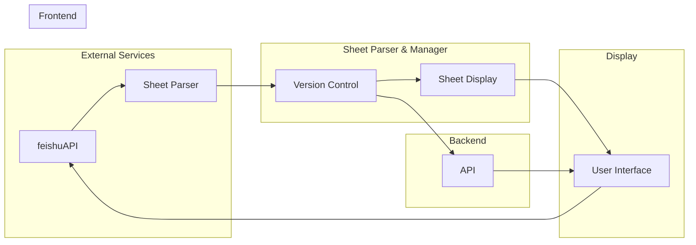
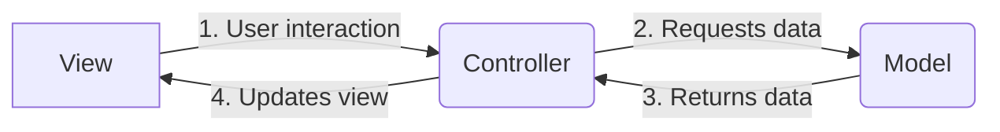

<h1 align="center" style="border-bottom: none">
    <b>
        <a href="https://docker.nsddd.top">CloudBuildAI</a><br>
    </b>
</h1>
<h3 align="center" style="border-bottom: none">
      ⭐️  AI automatically generates Docker and K8s deployment files.  ⭐️ <br>
<h3>


<p align=center>
<a href="https://goreportcard.com/report/github.com/kubecub/CloudBuildAI"></a>
<a href="https://github.com/issues?q=org%kubecub+is%3Aissue+label%3A%22good+first+issue%22+no%3Aassignee"></a>
<a href="https://github.com/kubecub/CloudBuildAI"></a>
<a href="https://join.slack.com/t/kubecub/shared_invite/zt-1se0k2bae-lkYzz0_T~BYh3rjkvlcUqQ"></a>
<a href="https://github.com/kubecub/CloudBuildAI/blob/main/LICENSE"></a>
<a href="https://golang.org/"></a>
</p>

</p>

<p align="center">
    <a href="./README.md"><b>English</b></a> •
    <a href="./README_zh-CN.md"><b>中文</b></a>
</p>

</p>

----

## 🧩 Awesome features

CloudBuildAI is an automated cloud-native application building and deployment tool that uses AI technology to generate Dockerfiles, Kubernetes YAML files, and other cloud platform deployment configurations for users.

In cloud-native application development, building Docker images and writing Kubernetes deployment files is a tedious and important task, and that's where CloudBuildAI comes in.

CloudBuildAI can automatically generate Dockerfiles and Kubernetes deployment files by inputting a GitHub repository address and automatically deploy the application on Sealos. If the files generated by AI are not accurate enough, CloudBuildAI can continuously optimize the accuracy of file generation through automatic repair and human feedback.

**Project Purpose:**
+ Simplify the cloud-native application deployment process
+ Make it easy for more developers to achieve automated CI/CD
+ Generate accurate Dockerfiles and Kubernetes YAML files through AI technology
+ Continuously optimize and improve, fix incorrect configurations, and improve deployment efficiency


## 🛫 Quick start 

> **Note**: You can get started quickly with CloudBuildAI.

1. Submit your GitHub repository address to CloudBuildAI
2. CloudBuildAI analyzes the code and generates Dockerfile and Kubernetes YAML files
3. Check the generated files and submit feedback to CloudBuildAI
4. CloudBuildAI continuously optimizes and improves
5. Merge the files generated by CloudBuildAI into the repository to achieve automated deployment!

#### Using AutoGPT

If you have access to the GPT-4 API, Auto-GPT yields better results as it is better at reasoning and drawing conclusions. It is also less prone to hallucinations. If you do not have access yet, you can join the waiting list for GPT-4 API access using the link provided here. However, you can also use the regular OpenAI API with the GPT-3.5 model.

**Preparation:**

1. Git
2. Python 3.8 or later
3. OpenAI API key
4. PineCone API key

Clone the repo using git:

```
❯ git clone https://github.com/Significant-Gravitas/Auto-GPT
❯ cd Auto-GPT
```

Install:

> The requirements.txt file is a text file commonly used in Python projects that includes all the required packages and their version information for the project.
>
> When we learned about the buildpacks project, we saw how it solved the problem of Python environment detection using the requirements.txt file.

```
❯ pip install -r requirements.txt
```

Next, rename `.env.template` to `.env`, and fill in the fields with your OpenAI and PineCone API keys.

```
❯ mv .env.template .env
```

Then, go to VIM, and paste your OpenAI API in the `OPENAI_API_KEY` section. You can refer to the image below for guidance.

```
❯ cat .env | grep -i OPENAI_API_KEY
## OPENAI_API_KEY - OpenAI API Key (Example: my-openai-api-key)
OPENAI_API_KEY=your-openai-api-key
```

Next, open [pinecone.io](https://www.wbolt.com/go?_=baa37b74edaHR0cHM6Ly93d3cucGluZWNvbmUuaW8v) and create a free account. It will allow LLM to retrieve relevant information from memory for use in AI applications.

Here, click `API Keys` on the left sidebar, and click `Create API Key` on the right pane.

Give a name, such as `autogpt`, and click `Create Key`


Copy the Key Value, open with `vim`, and paste it next to `PINECONE_API_KEY`.

Similarly, copy the values under `Environment`.

Now, paste it next to `PINECONE_ENV`.

#### Run

Open a terminal to run the `main.py` Python script.

```
❯ python3 -m autogpt
```

**Name AI:**

Auto-GPT will ask you to **name the AI** on the first run. If you do not want to create an AI for a specific use case, you can leave this field blank and press enter. It defaults to the Entrepreneur-GPT name.

**Define AI's role~**

Next, **set goals for the autonomous AI one by one**. This is where you tell the AI what goals you want to achieve. You can ask it to save information in a text or PDF file. You can also ask it to shut down after retrieving all the information.

**Define AI's role:**

Name and role your AI based on the functionality you wish for it to perform, such as "researcher," "content generator," or "personal encoder." To get more successful results, be clear about the goals you want the AI to accomplish.

**Set goals:**

Outline in detail what you want the AI to achieve, such as gathering information, storing data in a file, executing code, or modifying text. Include information about the output file to be used, as well as any other actions required to complete the task.

Goals are as follows:

1. Develop the product
2. Optimize the product
3. Expand the product's scope
4. Generate revenue of over 50 million dollars
5. Maintain this consistency

Auto-GPT will begin thinking. During the process, it will ask you to authorize actions. Press "y" and then press Enter to confirm. It may connect to websites and collect information.

You can read what the AI is **thinking, reasoning, and planning**. It also provides criticism (a negative prompt) so that it comes up with the right information. Finally, it executes the actions.

#### k8sgpt

+ [k8sgpt github address](https://github.com/k8sgpt-ai/k8sgpt/)

**go version:**

```
❯ gvm use 1.20
Now using version go1.20
❯ go version
go version go1.20 linux/amd64
```

**build k8sgpt:**

```
❯ cd k8sgpt
❯ make build
```

**Quick Start:**

Currently the default AI provider is OpenAI, you will need to generate an API key from OpenAI

> Note You can do this by running `k8sgpt generate` to open a browser link to generate it

Run `k8sgpt auth` new to set it in k8sgpt.

> Note You can provide the password directly using the `--password` flag.

Run `k8sgpt filters` to manage the active filters used by the analyzer. By default, all filters are executed during analysis.

Run `k8sgpt analyze` to run a scan.

And use `k8sgpt analyze` --explain to get a more detailed explanation of the issues.

**Example:**

```
❯ k8sgpt analyze -o json --explain --filter=Pod | jq 
```


<details>
  <summary>Work with Makefile</summary>

```bash
❯ make help    # show help
❯ make build   # build binary
```

</details>
<details>
  <summary>Work with actions</summary>

Actions provide handling of PR and issue.
We used the bot [🚀@cba](https://github.com/cba), It can detect issues in Chinese and translate them to English, and you can interact with it using the command `/comment`.

Comment in an issue:

```bash
❯ /intive
```

</details>
<details>
  <summary>Work with Tools</summary>

```bash
❯ make tools
```

</details>
<details>
  <summary>Work with Docker</summary>

```bash
❯ make deploy
```

</details>


## 🕋 architecture diagram


**MVC Architecture Design:**


## 🤖 File Directory Description

Catalog standardization design structure:

```bash
.CloudBuildAI
├── CONTRIBUTING.md          # Contribution guidelines
├── LICENSE                  # License information
├── Makefile                 # Makefile for building and running the project
├── README.md                # Project overview in English
├── README_zh-CN.md          # Project overview in Chinese
├── api                      # API-related files
│   ├── OWNERS               # API owners
│   └── README.md            # API documentation
├── assets                   # Static assets, such as images and stylesheets
│   └── README.md            # Assets documentation
├── build                    # Build-related files
│   ├── OWNERS               # Build owners
│   └── README.md            # Build documentation
├── cmd                      # Command-line tools and entry points
│   ├── OWNERS               # Command owners
│   └── README.md            # Command documentation
├── configs                  # Configuration files
│   ├── OWNERS               # Configuration owners
│   ├── README.md            # Configuration documentation
│   └── config.yaml          # Main configuration file
├── deploy                   # Deployment-related files
│   ├── OWNERS               # Deployment owners
│   └── README.md            # Deployment documentation
├── docs                     # Project documentation
│   ├── OWNERS               # Documentation owners
│   └── README.md            # Documentation index
├── examples                 # Example code and usage
│   ├── OWNERS               # Example owners
│   └── README.md            # Example documentation
├── init                     # Initialization files
│   ├── OWNERS               # Initialization owners
│   └── README.md            # Initialization documentation
├── internal                 # Internal application code
│   ├── OWNERS               # Internal code owners
│   ├── README.md            # Internal code documentation
│   ├── app                  # Application logic
│   ├── pkg                  # Internal packages
│   └── utils                # Utility functions and helpers
├── pkg                      # Public packages and libraries
│   ├── OWNERS               # Package owners
│   ├── README.md            # Package documentation
│   ├── common               # Common utilities and helpers
│   ├── log                  # Log utilities
│   ├── tools                # Tooling and scripts
│   ├── utils                # General utility functions
│   └── version              # Version information
├── scripts                  # Scripts for development and automation
│   ├── LICENSE_TEMPLATES    # License templates
│   ├── OWNERS               # Script owners
│   ├── README.md            # Script documentation
│   ├── githooks             # Git hooks for development
│   └── make-rules           # Makefile rules and scripts
├── test                     # Test files and test-related utilities
│   ├── OWNERS               # Test owners
│   └── README.md            # Test documentation
├── third_party              # Third-party dependencies and libraries
│   └── README.md            # Third-party documentation
├── tools                    # Tooling and utilities for development
│   └── README.md            # Tool documentation
└── web                      # Web-related files, such as HTML and CSS
    ├── OWNERS               # Web owners
    └── README.md            # Web documentation
```

## 🗓️ community meeting

We welcome everyone to join us and contribute to CloudBuildAI, whether you are new to open source or professional. We are committed to promoting an open source culture, so we offer community members neighborhood prizes and reward money in recognition of their contributions. We believe that by working together, we can build a strong community and make valuable open source tools and resources available to more people. So if you are interested in CloudBuildAI, please join our community and start contributing your ideas and skills!

We take notes of each [biweekly meeting](https://github.com/kubecub/CloudBuildAI/issues/2) in [GitHub discussions](https://github.com/kubecub/CloudBuildAI/discussions/categories/meeting), and our minutes are written in [Google Docs](https://docs.google.com/document/d/1nx8MDpuG74NASx081JcCpxPgDITNTpIIos0DS6Vr9GU/edit?usp=sharing).

CloudBuildAI maintains a [public roadmap](https://github.com/kubecub/community/tree/main/roadmaps). It gives a a high-level view of the main priorities for the project, the maturity of different features and projects, and how to influence the project direction.

## 🤼‍ Contributing & Development

kubecub Our goal is to build a top-level open source community. We have a set of standards, in the [Community repository](https://github.com/kubecub/community).

If you'd like to contribute to this CloudBuildAI repository, please read our [contributor documentation](https://github.com/kubecub/CloudBuildAI/blob/main/CONTRIBUTING.md).

Before you start, please make sure your changes are in demand. The best for that is to create a [new discussion](https://github.com/kubecub/CloudBuildAI/discussions/new/choose) OR [Slack Communication](https://join.slack.com/t/kubecub/shared_invite/zt-1se0k2bae-lkYzz0_T~BYh3rjkvlcUqQ), or if you find an issue, [report it](https://github.com/kubecub/CloudBuildAI/issues/new/choose) first.

> 👉 **Note:** The CloudBuildAI project is a preview version under development, all documents and codes are for reference only. The CloudBuildAI project may change frequently, and we do not guarantee that the information provided is the latest or accurate.


## 🚨 License

CloudBuildAI follows the [MIT open source license](https://github.com/kubecub/CloudBuildAI/blob/main/LICENSE).

Welcome to use and improve CloudBuildAI! We are committed to creating a more intelligent and easy-to-use cloud application deployment tool.


## 🔮 Thanks to our contributors!

<a href="https://github.com/kubecub/CloudBuildAI/graphs/contributors">
  
</a>
